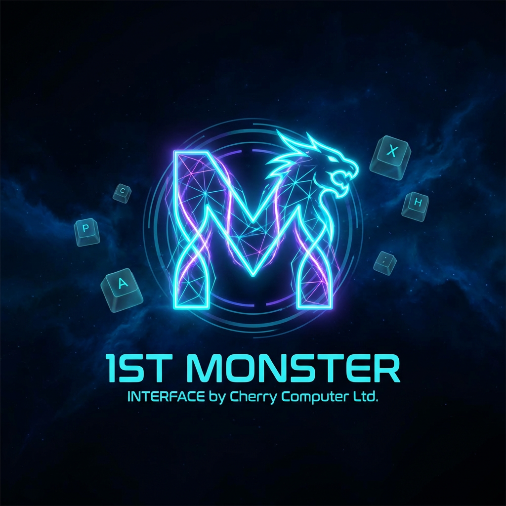

<div align="center">



# 🌌 1st Monster Interface

**The Future of Human-Computer Interaction**

*Created by [Cherry Computer Ltd.](https://github.com/Infinite-Networker)*

---

[](https://github.com/Infinite-Networker/1st-Monster-Interface)
[](https://github.com/Infinite-Networker/1st-Monster-Interface)
[](https://github.com/Infinite-Networker/1st-Monster-Interface)
[](https://github.com/Infinite-Networker)
[](LICENSE)
[](https://github.com/Infinite-Networker/1st-Monster-Interface/stargazers)

---

[](https://github.com/Infinite-Networker/1st-Monster-Interface)
[](https://github.com/Infinite-Networker/1st-Monster-Interface)
[](https://github.com/Infinite-Networker/1st-Monster-Interface)
[](https://github.com/Infinite-Networker/1st-Monster-Interface)
[](https://github.com/Infinite-Networker/1st-Monster-Interface)
[](https://github.com/Infinite-Networker/1st-Monster-Interface)
[](https://github.com/Infinite-Networker/1st-Monster-Interface)

</div>

---

## 🧬 Introduction

> *"The 1st Monster transcends traditional input methods, offering users a seamless and immersive interface."*
> — **Technical Document: 1st Monster Interface, Cherry Computer Ltd.**

The **1st Monster Interface** is the cornerstone of the **Cherry Computer – Stardust Augmental** platform, representing a monumental shift in human-computer interaction. By fusing **Augmented Reality (AR)**, **Virtual Reality (VR)**, **advanced projection technology**, and **neural communication**, 1st Monster eliminates the need for physical peripherals entirely — replacing keyboards and mice with mid-air gestures, thought-controlled commands, and holographic projection systems.

This repository contains the full interface implementation, SDK, simulation demos, and documentation for the 1st Monster Interface system — built by **Cherry Computer Ltd.**

---

## ✨ Key Features

<div align="center">

| Feature | Description | Status |
|---|---|---|
| 🖐️ **Mid-Air Typing** | Virtual force field enables precision typing in thin air | ✅ Active |
| 🧠 **Neural Interaction** | Thought-controlled inputs via brain-machine communication | ✅ Active |
| ⌨️ **Projection Keyboard** | Holographic keyboard visible from any angle | ✅ Active |
| 🌐 **AR Integration** | Contextual projections blending digital & physical worlds | ✅ Active |
| 🕹️ **Gesture Control** | Full-body gesture recognition for fluid device interaction | ✅ Active |
| 💥 **Haptic Feedback** | Simulated physical sensation during virtual interactions | ✅ Active |
| 🧩 **Adaptive Interface** | Self-personalizing UI based on user behavior patterns | 🔄 Beta |
| 🤝 **Cognitive Learning** | Neural accuracy improves over time from user thought patterns | 🔄 Beta |

</div>

---

## 🚀 Technology Stack

```
┌─────────────────────────────────────────────────────────────┐
│              Cherry Computer — Stardust Augmental           │
│                    1st Monster Interface                    │
├─────────────────────────────────────────────────────────────┤
│  🔵 Augmented Reality Layer   ← contextual projections      │
│  🟣 Virtual Reality Engine    ← immersive environment core  │
│  🔴 Neural Signal Processor   ← thought-to-action pipeline  │
│  🟡 Projection Subsystem      ← air-based holographic I/O   │
│  🟢 Gesture Recognition       ← full-body motion capture    │
│  ⚪ Haptic Simulation Layer   ← tactile feedback engine      │
│  🔷 Cognitive Adapter         ← user-pattern learning AI    │
└─────────────────────────────────────────────────────────────┘
```

<div align="center">


</div>

---

## 📂 Repository Structure

```
1st-Monster-Interface/
├── 📁 assets/               # Logos, images, media
│   └── logo.png
├── 📁 src/
│   ├── 📁 core/             # Core interface engine
│   │   ├── monster.ts       # Main Monster Interface class
│   │   ├── neural.ts        # Neural interaction module
│   │   └── projection.ts    # Projection keyboard engine
│   ├── 📁 ar/               # AR/VR integration layer
│   │   ├── ar-layer.ts      # Augmented Reality layer
│   │   └── vr-engine.ts     # Virtual Reality engine
│   ├── 📁 gesture/          # Gesture recognition system
│   │   └── gesture-engine.ts
│   ├── 📁 haptic/           # Haptic feedback simulation
│   │   └── haptic-sim.ts
│   └── 📁 adaptive/         # Cognitive & adaptive learning
│       └── cognitive-adapter.ts
├── 📁 demo/                 # Interactive browser demo
│   ├── index.html
│   ├── demo.js
│   └── styles.css
├── 📁 docs/                 # Full documentation
│   └── ARCHITECTURE.md
├── 📁 tests/                # Unit & integration tests
│   └── monster.test.ts
├── .gitignore
├── LICENSE
├── package.json
└── README.md
```

---

## 🧠 Core Concepts

### 1. Neural Interaction Pipeline

The 1st Monster reads user **thought patterns** and translates them into precise device actions. The system continuously learns from the user's cognitive signatures, improving accuracy with each session.

```python
# Neural interaction example
from monster_interface import NeuralProcessor

brain = NeuralProcessor()
brain.connect(user_profile="alpha_user")

# Translate thought to action
action = brain.decode_signal(signal=brain.read_thought())
monster.execute(action)
```

### 2. Mid-Air Projection Keyboard

A holographic keyboard is projected in any plane the user chooses. Customizable layouts (gaming, professional, casual) adapt to context.

```typescript
import { ProjectionKeyboard } from './src/core/projection';

const keyboard = new ProjectionKeyboard({
  layout: 'professional',
  hapticFeedback: true,
  adaptiveAngle: true,
});

keyboard.project({ x: 0, y: 1.2, z: -0.5 });
keyboard.onKeyPress((key) => console.log(`Key pressed: ${key}`));
```

### 3. AR/VR Seamless Integration

Digital objects are rendered over real-world environments with full interaction support — manipulate 3D models, visualize data, or collaborate globally in shared AR spaces.

```typescript
import { ARLayer } from './src/ar/ar-layer';

const ar = new ARLayer();
ar.enable();
ar.projectObject({ model: 'hologram_cube', position: [0, 1, -2] });
ar.onInteract((object) => object.manipulate());
```

### 4. Gesture Recognition Engine

Full-body gesture capture allows navigation and control without any physical device contact.

```typescript
import { GestureEngine } from './src/gesture/gesture-engine';

const gesture = new GestureEngine({ sensitivity: 0.95, fullBody: true });
gesture.onGesture('swipe_right', () => monster.nextPage());
gesture.onGesture('pinch', () => monster.zoom(1.5));
gesture.onGesture('wave', () => monster.openMenu());
```

---

## 🎮 Use Cases

<div align="center">

| Domain | Application | Powered By |
|---|---|---|
| 🎮 **Gaming** | Full-body avatar control, immersive environments | Neural + Gesture |
| 🎓 **Education** | Interactive simulations, virtual classrooms | AR + Projection |
| 🎨 **Creative Design** | 3D object sculpting, real-time collaboration in AR | AR/VR + Haptic |
| 🏥 **Healthcare** | Medical data visualization, surgical AR overlays | AR + Neural |
| 🏗️ **Architecture** | Holographic blueprints, live spatial editing | Projection + VR |
| 💼 **Professional** | Streamlined workflows, remote AR collaboration | All Systems |

</div>

---

## ⚡ Getting Started

### Prerequisites

```bash
node >= 18.0.0
python >= 3.10
npm >= 9.0.0
```

### Installation

```bash
# Clone the repository
git clone https://github.com/Infinite-Networker/1st-Monster-Interface.git
cd 1st-Monster-Interface

# Install dependencies
npm install

# Install Python neural module dependencies
pip install -r requirements.txt

# Run the interactive demo
npm run demo
```

### Launch Interface Simulation

```bash
# Start the full interface simulation
npm run start

# Run in AR preview mode
npm run ar-preview

# Run neural module tests
npm run test:neural
```

---

## 🖥️ Interactive Demo

Open `demo/index.html` in any WebXR-compatible browser to explore the **1st Monster Interface** visual simulation — featuring:
- 🌌 Holographic projection keyboard visualization
- 🧠 Neural signal waveform renderer
- 🌀 AR/VR environment preview
- ✋ Gesture tracking canvas overlay
- 💜 Full cyberpunk UI with real-time stats

---

## 🏛️ Architecture Overview

```
User ──► Thought Signal ──► Neural Processor ──► Action Decoder
                                                       │
         Physical Space ──► AR Camera ──► AR Layer ◄──┘
                                              │
         Projection Plane ◄── Keyboard Engine ┘
                │
         Haptic Emitter ◄── Feedback Simulator
                │
         Gesture Sensor ──► Motion Engine ──► Device Control
```

---

## 📜 About Cherry Computer Ltd.

<div align="center">

> **Cherry Computer Ltd.** is the visionary technology company behind the **Stardust Augmental** platform — a next-generation computing ecosystem that eliminates physical hardware boundaries and replaces them with seamless human-digital symbiosis. The **1st Monster Interface** is Cherry Computer's flagship interaction system, representing years of research in neural computing, augmented reality, and spatial projection technology.

[](https://github.com/Infinite-Networker)
[](https://github.com/Infinite-Networker)

</div>

---

## 📄 License

This project is licensed under the **MIT License** — see the [LICENSE](LICENSE) file for details.

---

## 🙌 Contributing

Contributions, issues, and feature requests are welcome! Feel free to check the [issues page](https://github.com/Infinite-Networker/1st-Monster-Interface/issues).

```bash
# Fork → Branch → Commit → Push → Pull Request
git checkout -b feature/your-feature-name
git commit -m "feat: add your feature"
git push origin feature/your-feature-name
```

---

<div align="center">

**Built with 💜 by [Cherry Computer Ltd.](https://github.com/Infinite-Networker)**

*© 2026 Cherry Computer Ltd. — All Rights Reserved*

⭐ **Star this repo** if you believe the future of computing is physical-free!

</div>
